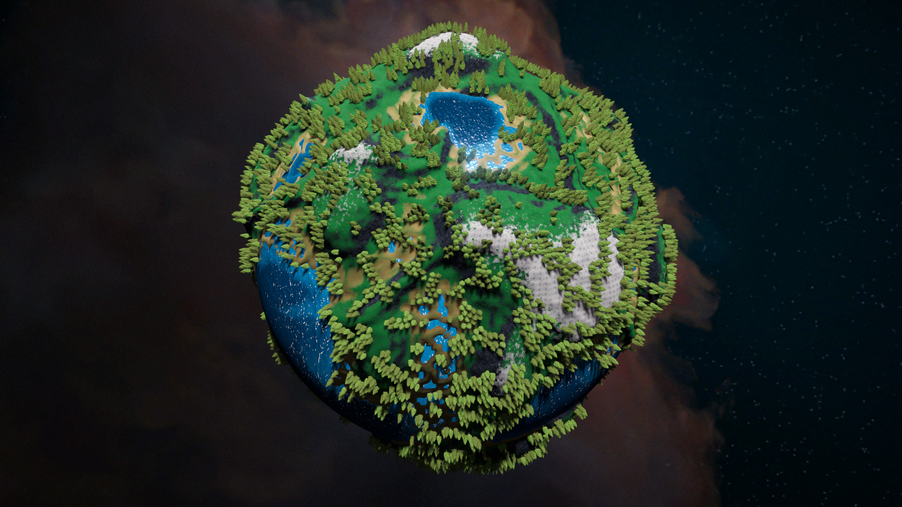

# Planer Designer

This Unity tool generates game worlds in the form of planets. The tool was originally created as part of my bachelor thesis in Computer Science, Game Development, and has since been further developed.

## Screenshots




## Help

I get the following error when opening the project on Windows:

```bash
An error occured while resolving packages:
  Project has invalid dependencies:
    com.jimmycushnie.noisynodes: No 'git' executable was found
```

Solution:
- In the windows search bar: search for and open "%appdata%"
- Navigate to "AppData\Local\GitHubDesktop\app-x.x.x\resources\app\git\cmd" and copy the path of that folder
- In the windows search bar: search for and open "Edit the system environment variables"
- In the Advanced tab, click on "Environment Variables"
- Under System variables, find and click on "Path", then "Edit" and "New". Paste the copied directory, then click "OK", "OK", and "OK"
- Restart Unity and Unity Hub
